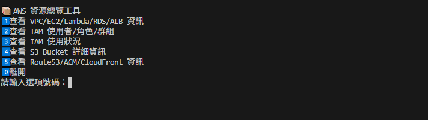
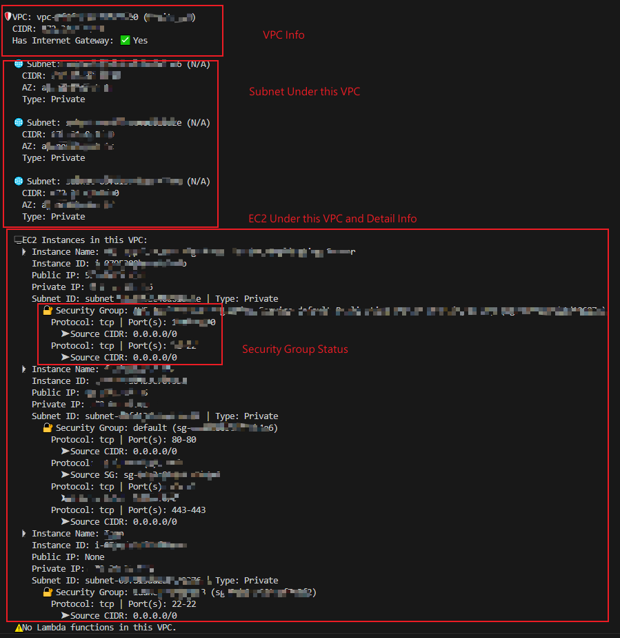
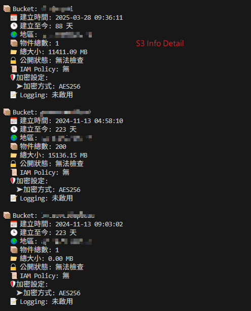

# AWS_DashBorad








- You can check VPC , EC2 , Lambda , RDS ,ALB ,IAM ,S3 , Route53 ,ACM , CloudFront
  From this repo

## 1. Replace your AWS SES INFO to .env file with AdminPermissionKey

- AWS_ACCESS_KEY = AWS_ACCESS_KEY
- AWS_SECRET_KEY = AWS_SECRET_KEY
- AWS_REGION = AWS_REGION

## 2. Install python and run it

```
python main.py
```

## 3. Export to exe file with .env argument

```
pyinstaller --onefile --add-data ".env;." main.py
```
